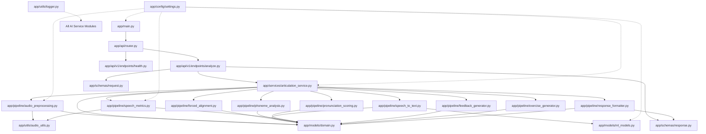
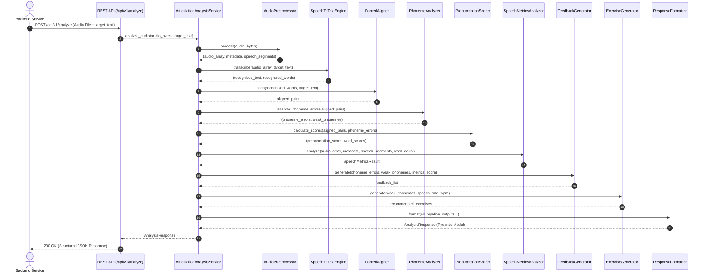

# AI Service Developer Architecture & Technical Guide
**AI Smart Articulation Training System**

---

## 1. AI Service Overview

### Purpose of the AI Service
The **AI Service** is a dedicated, stateless, high-performance microservice designed to evaluate human speech articulation, pronunciation accuracy, phonetic precision, speaking pace, and speech fluency. It provides actionable acoustic feedback and custom practice drill recommendations to help users improve their articulation.

### Key Responsibilities
1. **Audio Ingestion & Signal Preprocessing**: Converts raw multi-format audio uploads (WAV, MP3, M4A, WEBM, OGG) into normalized 16kHz mono audio signals and performs Voice Activity Detection (VAD).
2. **Speech Recognition (STT)**: Transcribes speech into text and extracts high-resolution word-level start/end timestamps.
3. **Forced Alignment**: Synchronizes reference target phrases with actual spoken audio frames using dynamic time alignment.
4. **Phoneme Analysis & G2P Mapping**: Maps words to phonetic representations (IPA/ARPAbet) and detects substitution, deletion, insertion, or distortion errors.
5. **Pronunciation & GOP Scoring**: Computes Goodness of Pronunciation (GOP) acoustic confidence scores per phoneme and word.
6. **Speech Metrics Analysis**: Evaluates pitch (fundamental frequency F0), speaking rate (words per minute excluding pauses), pause duration/frequency, speech clarity, and speech fluency.
7. **Feedback & Exercise Recommendation**: Synthesizes acoustic findings into human-readable advice and custom drill exercises tailored to specific weak phonemes.
8. **Structured Response Generation**: Validates and returns a standardized JSON payload over REST HTTP APIs.

### Overall Workflow & Communication Architecture
The AI Service operates completely isolated from frontend clients, databases, and user authentication systems. The external Backend Service communicates with the AI Service via HTTP REST calls (`POST /api/v1/analyze` and `POST /api/v1/analyze-json`).

```
+------------------+         REST API (HTTP POST)          +------------------+
| Backend Service  |  ---------------------------------->  |    AI Service    |
| (FastAPI / Node) |                                       |  (FastAPI App)   |
|                  |  <----------------------------------  |                  |
+------------------+           Structured JSON             +------------------+
```

- **Input**: Audio binary stream or Base64 string, target reference sentence (optional), exercise type, language code.
- **Output**: Validated JSON payload containing overall score, clarity, fluency, pronunciation, speech rate, word scores, phoneme errors, weak phonemes, feedback messages, and practice exercise recommendations.

---

## 2. AI Processing Pipeline

The execution flow inside the AI Service follows a strict 9-stage sequential pipeline managed by the `ArticulationAnalysisService` orchestrator:

```
Input Audio Stream / Base64
           |
           v
[Stage 1: Audio Preprocessing & VAD]
           |
           v
[Stage 2: Speech Recognition (Whisper STT)]
           |
           v
[Stage 3: Forced Alignment (DTW / Sequence Align)]
           |
           v
[Stage 4: Phoneme Analysis & Error Detection]
           |
           v
[Stage 5: Pronunciation Scoring (GOP & Word Scores)]
           |
           v
[Stage 6: Speech Metrics (Pitch, Pace, Pauses, Clarity, Fluency)]
           |
           v
[Stage 7: Feedback Generator]
           |
           v
[Stage 8: Exercise Recommendation Generator]
           |
           v
[Stage 9: Response Formatter]
           |
           v
Structured JSON Response
```

### Stage-by-Stage Breakdown

| Stage # | Stage Name | Purpose | Stage Input | Stage Output | Inter-Stage Data Flow |
| :--- | :--- | :--- | :--- | :--- | :--- |
| **1** | **Audio Preprocessing** | Standardizes sample rate, converts to mono, normalizes volume, trims silence via VAD. | Bytes / File / Numpy array | `(audio_array, AudioMetadata, List[SpeechSegment])` | Passes normalized 16kHz float32 audio array and active speech segments to downstream stages. |
| **2** | **Speech Recognition** | Transcribes audio to text and generates word-level start/end timestamps. | `audio_array`, optional `target_text` | `(recognized_text, List[RecognizedWord])` | Passes transcribed string and timestamped `RecognizedWord` objects to aligner. |
| **3** | **Forced Alignment** | Aligns target expected sentence tokens with recognized audio words. | `List[RecognizedWord]`, `target_text` | `List[Tuple[str, RecognizedWord \| None]]` | Produces paired target-word-to-spoken-word mapping for phonetic evaluation. |
| **4** | **Phoneme Analysis** | Converts words to IPA phonemes and detects phoneme substitutions, deletions, and insertions. | `List[Tuple[str, RecognizedWord \| None]]` | `(List[PhonemeError], List[str])` | Extracts list of detected phoneme error objects and list of identified weak phonemes. |
| **5** | **Pronunciation Scoring** | Computes Goodness of Pronunciation (GOP) phoneme scores, word scores, and overall score. | Aligned pairs, `List[PhonemeError]` | `(pronunciation_score, List[WordScore])` | Calculates 0-100 numerical scores for every phoneme and word. |
| **6** | **Speech Metrics** | Analyzes pitch F0 stability, speaking pace (WPM), pauses, clarity, and fluency. | `audio_array`, `AudioMetadata`, `SpeechSegment`, word count | `SpeechMetricsResult` | Computes speech rate WPM, total pauses, pause duration, clarity score, and fluency score. |
| **7** | **Feedback Generator** | Formulates constructive, plain-language articulation advice based on acoustic metrics. | Errors, weak phonemes, metrics, pronunciation score | `List[str]` | Produces list of personalized feedback strings. |
| **8** | **Exercise Generator** | Selects targeted practice drills and tongue twisters targeting weak phonemes. | `List[str]` weak phonemes, `speech_rate_wpm` | `List[dict]` | Generates structured drill exercise dictionaries. |
| **9** | **Response Formatter** | Aggregates all stage outputs and validates them against the Pydantic JSON contract. | All pipeline stage outputs | `AnalysisResponse` Pydantic Model | Formats final JSON payload matching backend API contract. |

---

## 3. Models Folder (`app/models/`)

The `app/models/` folder contains internal domain dataclasses and deep learning model lifecycle managers.

### 3.1 `app/models/domain.py`
- **Purpose**: Defines pure Python `@dataclass` structures used for type-safe data transfers between pipeline stages.
- **Responsibilities**: Represents domain entities without external framework bindings.
- **Data Structures**:
  - `AudioMetadata`: Stores duration in seconds, sample rate, channel count, sample count, and speech presence flag (`has_speech`).
  - `SpeechSegment`: Stores VAD speech segment timestamps (`start_ms`, `end_ms`, `duration_ms`).
  - `RecognizedWord`: Represents a single word output from STT with `word`, `start_ms`, `end_ms`, `confidence`, and phoneme list.
  - `PhonemeScore`: Stores individual phoneme symbol, score (0-100), and `error_type`.
  - `PhonemeError`: Detail object for detected errors storing `phoneme`, `expected`, `detected`, `error_type`, `word`, and `position_ms`.
  - `WordScore`: Aggregates word text, word score, and list of child `PhonemeScore` objects.
  - `SpeechMetricsResult`: Dataclass holding pitch statistics (`mean_pitch_hz`, `pitch_std_hz`), speech pace (`speech_rate_wpm`), pauses (`total_pauses`, `total_pause_duration_ms`), `clarity_score`, and `fluency_score`.
  - `PipelineResult`: Aggregate dataclass wrapping all stage outputs prior to JSON response formatting.

### 3.2 `app/models/ml_models.py`
- **Purpose**: Provides thread-safe singleton loading and caching for deep learning models (OpenAI Whisper and Wav2Vec2).
- **Responsibilities**:
  - Lazy-loads deep learning model weights into memory upon first request.
  - Controls GPU (`cuda`) vs CPU allocation based on system configuration.
  - Implements fallback mechanisms to allow lightweight execution when model checkpoints are loading or offline.
- **Classes & Functions**:
  - `ModelManager`: Singleton class managing `_whisper_model` and `_wav2vec_model`.
  - `load_whisper()`: Downloads/loads Whisper STT checkpoint.
  - `load_wav2vec2()`: Loads HuggingFace Wav2Vec2 CTC phoneme recognition model and processor.
  - `is_whisper_loaded()`, `is_wav2vec2_loaded()`: Status checkers.
  - `get_model_manager()`: Dependency provider returning singleton instance.
- **Dependencies**: `whisper`, `transformers`, `torch`, `app.config.settings`.

---

## 4. Pipeline Modules (`app/pipeline/`)

Every pipeline module is isolated, single-responsibility, and independently testable.

### 4.1 `audio_preprocessing.py`
- **Purpose**: Normalizes input audio signals and trims silent intervals using VAD.
- **Responsibilities**: Convert multi-channel/multi-format audio to 16kHz mono float32 array, perform peak normalization, and detect active speech boundaries.
- **Workflow**: `load_audio()` -> `resample_audio()` -> `normalize_audio()` -> `_detect_voice_activity()`.
- **Input**: `bytes`, file path, or `np.ndarray`.
- **Output**: Tuple of `(audio_array: np.ndarray, metadata: AudioMetadata, speech_segments: List[SpeechSegment])`.
- **Algorithms**: Librosa energy-based interval splitting (`librosa.effects.split`), peak scaling to 0.95 max amplitude.
- **External Libraries**: `librosa`, `soundfile`, `numpy`.

### 4.2 `speech_to_text.py`
- **Purpose**: Transcribes audio into text and extracts word-level timing boundaries.
- **Responsibilities**: Execute Whisper model inference with word timestamps enabled, or run fallback timing alignment if offline.
- **Input**: `audio: np.ndarray`, optional `target_text: str`.
- **Output**: Tuple of `(recognized_text: str, words: List[RecognizedWord])`.
- **Algorithms**: Sequence-to-sequence beam search decoding via Whisper, timestamp extraction from cross-attention matrix.
- **External Libraries**: `openai-whisper`, `torch`, `numpy`.

### 4.3 `forced_alignment.py`
- **Purpose**: Aligns target reference text tokens with actual recognized audio words.
- **Responsibilities**: Perform sequence matching between expected words and recognized spoken words to identify word omissions or insertions.
- **Input**: `recognized_words: List[RecognizedWord]`, optional `target_text: str`.
- **Output**: `List[Tuple[str, RecognizedWord | None]]`.
- **Algorithms**: Dynamic Programming (Needleman-Wunsch / Levenshtein sequence alignment with substitution/insertion/deletion costs).

### 4.4 `phoneme_analysis.py`
- **Purpose**: Performs Grapheme-to-Phoneme (G2P) phonetic conversion and detects phoneme errors.
- **Responsibilities**: Map words to IPA/ARPAbet phonemes, compare expected phoneme sequences with spoken phonemes, categorize errors (`substitution`, `deletion`, `insertion`, `distortion`), and identify weak phonemes.
- **Input**: Aligned word tuples `List[Tuple[str, RecognizedWord | None]]`.
- **Output**: Tuple of `(phoneme_errors: List[PhonemeError], weak_phonemes: List[str])`.
- **Algorithms**: Rule-based G2P phonetic mapping dictionary lookup with rule fallback; sequence error alignment.

### 4.5 `pronunciation_scoring.py`
- **Purpose**: Calculates Goodness of Pronunciation (GOP) scores and word scores.
- **Responsibilities**: Compute numerical scores (0-100) per phoneme and word, penalizing phoneme substitutions and omissions.
- **Input**: Aligned word tuples, `phoneme_errors: List[PhonemeError]`.
- **Output**: Tuple of `(pronunciation_score: float, word_scores: List[WordScore])`.
- **Algorithms**: Weighted acoustic confidence scoring, GOP penalty matrix.

### 4.6 `speech_metrics.py`
- **Purpose**: Measures acoustic speech properties including pitch, pace, pauses, clarity, and fluency.
- **Responsibilities**: Extract pitch F0 mean and standard deviation, compute speaking rate in WPM excluding pauses, calculate pause metrics, and derive 0-100 clarity and fluency scores.
- **Input**: `audio: np.ndarray`, `metadata: AudioMetadata`, `speech_segments: List[SpeechSegment]`, `word_count: int`.
- **Output**: `SpeechMetricsResult` object.
- **Algorithms**: Librosa `pyin` fundamental frequency tracking, spectral centroid clarity estimation, WPM pace deviation penalties.
- **External Libraries**: `librosa`, `praat-parselmouth`, `numpy`, `scipy`.

### 4.7 `feedback_generator.py`
- **Purpose**: Translates quantitative speech analysis into plain-language actionable advice.
- **Responsibilities**: Map detected weak phonemes, speech rate anomalies, and high pause counts into constructive feedback statements.
- **Input**: `phoneme_errors`, `weak_phonemes`, `metrics: SpeechMetricsResult`, `pronunciation_score`.
- **Output**: `List[str]` feedback sentences.

### 4.8 `exercise_generator.py`
- **Purpose**: Selects targeted articulation practice exercises based on user weaknesses.
- **Responsibilities**: Match identified weak phonemes (e.g. /æ/, /θ/, /r/, /l/) to specific tongue placement drills, word lists, and pacing exercises.
- **Input**: `weak_phonemes: List[str]`, `speech_rate_wpm: float`.
- **Output**: `List[dict]` containing title, category, target_phoneme, target_words, and instructions.

### 4.9 `response_formatter.py`
- **Purpose**: Assembles all stage outputs into the final validated Pydantic model matching the API response contract.
- **Responsibilities**: Compute weighted overall score (50% Pronunciation, 30% Clarity, 20% Fluency), convert domain dataclasses into response schemas, and validate data types.
- **Input**: All outputs from Stages 1 through 8.
- **Output**: `AnalysisResponse` Pydantic instance.

---

## 5. Services (`app/services/`)

### `app/services/articulation_service.py`
- **Purpose**: Serves as the primary business logic orchestrator (`ArticulationAnalysisService`) for the AI Service.
- **Responsibilities**:
  - Initializes and manages all 9 pipeline stage modules using **Dependency Injection**.
  - Exposes `analyze_audio(audio_source, target_text)` entrypoint method.
  - Sequentially invokes each pipeline stage, passing intermediate results forward.
  - Logs execution progress and timing.
  - Handles runtime exceptions gracefully and wraps errors for API layer consumption.
- **Dependency Injection Pattern**:
  ```python
  def __init__(
      self,
      audio_preprocessor: Optional[AudioPreprocessor] = None,
      stt_engine: Optional[SpeechToTextEngine] = None,
      ...
  ):
      self.preprocessor = audio_preprocessor or AudioPreprocessor()
      self.stt_engine = stt_engine or SpeechToTextEngine()
      ...
  ```
- **Error Handling**: Catches audio decoding errors, empty speech failures, and inference exceptions, logging tracebacks before propagating structured HTTP exceptions to API endpoints.

---

## 6. Schemas (`app/schemas/`)

Pydantic schemas enforce strict data validation and automated OpenAPI specification generation.

### 6.1 `app/schemas/request.py`
- `AnalysisRequest`: Pydantic model for JSON requests containing Base64 encoded audio.
  - `audio_base64`: `str` (Required) - Base64 encoded audio file payload.
  - `target_text`: `Optional[str]` (Optional) - Expected reference sentence.
  - `exercise_type`: `Optional[str]` (Default: `"word"`) - `word`, `sentence`, `paragraph`, `free_speech`.
  - `language`: `Optional[str]` (Default: `"en"`) - Language code.

### 6.2 `app/schemas/response.py`
- `PhonemeScoreSchema`: `phoneme` (str), `score` (float 0-100), `error_type` (Optional[str]).
- `WordScoreSchema`: `word` (str), `score` (float 0-100), `phonemes` (List[PhonemeScoreSchema]).
- `PhonemeErrorSchema`: `phoneme` (str), `expected` (str), `detected` (str), `error_type` (str), `word` (str), `position_ms` (Tuple[float, float]).
- `ExerciseRecommendationSchema`: `title` (str), `category` (str), `target_phoneme` (str), `target_words` (List[str]), `instructions` (str).
- `AnalysisResponse`: Primary top-level response schema:
  - `overall_score`: `float` (0-100)
  - `clarity`: `float` (0-100)
  - `fluency`: `float` (0-100)
  - `pronunciation`: `float` (0-100)
  - `speech_rate`: `float` (WPM)
  - `recognized_text`: `str`
  - `word_scores`: `List[WordScoreSchema]`
  - `phoneme_errors`: `List[PhonemeErrorSchema]`
  - `weak_phonemes`: `List[str]`
  - `feedback`: `List[str]`
  - `recommended_exercises`: `List[ExerciseRecommendationSchema]`
- `HealthCheckResponse`: `status` (str), `app_name` (str), `version` (str), `whisper_loaded` (bool), `wav2vec2_loaded` (bool), `device` (str).

---

## 7. Utilities (`app/utils/`)

### 7.1 `app/utils/audio_utils.py`
- `load_audio(source, target_sr=16000)`: Reads audio from raw bytes, `io.BytesIO`, or file path into a 1D float32 numpy array. Converts multi-channel audio to mono and resamples to target sample rate. Includes `librosa` fallback if `soundfile` encounters unsupported header formats.
- `normalize_audio(audio)`: Scales numpy audio array to maximum absolute amplitude of 0.95.
- `resample_audio(audio, orig_sr, target_sr)`: Resamples audio array using `librosa.resample`.
- `save_temp_audio(audio, sr)`: Writes numpy audio array to a temporary `.wav` file on disk for external tools and returns the absolute path.
- `compute_audio_duration(audio, sr)`: Returns audio duration in seconds.

### 7.2 `app/utils/logger.py`
- `get_logger(name)`: Configures a structured Python `logging.Logger` with standard timestamp formatting (`YYYY-MM-DD HH:MM:SS`), logging level, module name, function name, line number, and message output to `sys.stdout`.

---

## 8. Configuration (`app/config/`)

### `app/config/settings.py`
Application configuration uses `pydantic-settings.BaseSettings`, automatically reading values from environment variables or `.env` files with strict type validation.

| Setting Parameter | Environment Variable | Default Value | Description |
| :--- | :--- | :--- | :--- |
| `APP_NAME` | `APP_NAME` | `"AI Smart Articulation..."` | Application title |
| `APP_VERSION` | `APP_VERSION` | `"1.0.0"` | Application version |
| `APP_ENV` | `APP_ENV` | `"development"` | Environment (`development`, `production`, `test`) |
| `DEBUG` | `DEBUG` | `True` | Debug mode toggle |
| `HOST` | `HOST` | `"0.0.0.0"` | Server listen address |
| `PORT` | `PORT` | `7222` | Server HTTP port |
| `SAMPLE_RATE` | `SAMPLE_RATE` | `16000` | Target audio sample rate (Hz) |
| `WHISPER_MODEL_SIZE` | `WHISPER_MODEL_SIZE` | `"base"` | Whisper model weight size (`tiny`, `base`, `small`, `medium`) |
| `WAV2VEC2_MODEL_ID` | `WAV2VEC2_MODEL_ID` | `"facebook/wav2vec2..."` | HuggingFace model identifier |
| `DEVICE` | `DEVICE` | `"cpu"` | PyTorch device (`cpu`, `cuda`, `mps`) |
| `MODEL_CACHE_DIR` | `MODEL_CACHE_DIR` | `"./model_cache"` | Local directory for ML model weights |
| `LOG_LEVEL` | `LOG_LEVEL` | `"INFO"` | Logging verbosity (`DEBUG`, `INFO`, `WARNING`, `ERROR`) |

---

## 9. Dependency Graph

The following Mermaid diagram illustrates module dependencies across API endpoints, services, pipeline stages, models, schemas, and utilities:



---

## 10. Sequence Diagram

The following sequence diagram details the complete execution flow from an incoming REST API request to the final JSON response:



---

## 11. File Interaction Path

The exact file-to-file execution chain during an audio analysis request is as follows:

```
1. app/main.py
   ├── Receives HTTP request and forwards to central router
   
2. app/api/router.py
   ├── Routes request to API v1 endpoints
   
3. app/api/v1/endpoints/analyze.py
   ├── Parses multipart form or base64 JSON request payload
   ├── Invokes ArticulationAnalysisService
   
4. app/services/articulation_service.py
   ├── Coordinates 9 pipeline stages sequentially:
   │
   ├──> 5. app/pipeline/audio_preprocessing.py (uses app/utils/audio_utils.py)
   ├──> 6. app/pipeline/speech_to_text.py (uses app/models/ml_models.py)
   ├──> 7. app/pipeline/forced_alignment.py
   ├──> 8. app/pipeline/phoneme_analysis.py
   ├──> 9. app/pipeline/pronunciation_scoring.py
   ├──> 10. app/pipeline/speech_metrics.py (uses app/utils/audio_utils.py)
   ├──> 11. app/pipeline/feedback_generator.py
   ├──> 12. app/pipeline/exercise_generator.py
   └──> 13. app/pipeline/response_formatter.py (uses app/schemas/response.py)
   
14. Returns AnalysisResponse JSON to Backend Service
```

---

## 12. Technology Stack

| Technology | Role in AI Service | Why Used & Advantages | Alternatives Considered |
| :--- | :--- | :--- | :--- |
| **Python 3.12+** | Core Programming Language | High readability, rich scientific computing ecosystem, native support for ML frameworks. | C++ (higher complexity), Node.js (weaker ML library ecosystem). |
| **FastAPI** | REST API Web Framework | High performance (Asgi/Starlette), native Pydantic validation, automatic OpenAPI Swagger generation. | Flask (slower, synchronous), Django (too heavy, bloated for microservices). |
| **PyTorch** | Deep Learning Engine | Dynamic computation graph, industry standard for speech & NLP models, seamless GPU acceleration. | TensorFlow (less flexible), ONNX Runtime (good for inference deployment). |
| **Whisper** | Speech-to-Text Model | SOTA robustness across accents, background noise, and native support for word-level timestamps. | Kaldi (complex setup), Vosk (lower accuracy on diverse accents). |
| **Librosa** | Digital Audio Signal Processing | Accurate audio resampling, spectral centroid analysis, pitch tracking (`pyin`), and VAD splitting. | PyAudio (hardware focused), SciPy signal (lower level). |
| **NumPy** | Array Data Manipulation | Fast C-optimized vectorized operations on audio waveform arrays. | Pure Python lists (prohibitively slow for audio buffers). |
| **Parselmouth** | Acoustic Formant & Pitch Analysis | Python interface to Praat's phonetic algorithms for fundamental frequency (F0) tracking. | Pure Librosa pitch (Praat offers superior phonetic precision). |
| **wav2vec2** | Phoneme Recognition Model | Acoustic model producing frame-level CTC probabilities for phoneme alignment. | DeepSpeech (deprecated), Jasper (less accessible). |
| **Pydantic v2** | Data Schema Validation | Fast Rust-backed schema validation, environment settings management, and OpenAPI schema generation. | Marshmallow (slower), Cerberus (less type integration). |
| **Pytest** | Automated Testing Framework | Simple fixture mechanism, seamless test discovery, and support for async endpoint testing. | Unittest (more boilerplate). |

---

## 13. API Response Breakdown

Below is an exhaustive description of every field in the returned JSON response, explaining how each value is calculated and produced:

```json
{
  "overall_score": 88.0,
  "clarity": 91.0,
  "fluency": 84.0,
  "pronunciation": 86.0,
  "speech_rate": 122.0,
  "recognized_text": "The quick brown fox jumps over the lazy dog",
  "word_scores": [
    {
      "word": "quick",
      "score": 90.0,
      "phonemes": [
        { "phoneme": "k", "score": 92.0, "error_type": null },
        { "phoneme": "w", "score": 88.0, "error_type": null }
      ]
    }
  ],
  "phoneme_errors": [
    {
      "phoneme": "æ",
      "expected": "æ",
      "detected": "ɛ",
      "error_type": "substitution",
      "word": "example",
      "position_ms": [120.0, 240.0]
    }
  ],
  "weak_phonemes": ["æ", "θ"],
  "feedback": [
    "For the short vowel /æ/ as in 'cat', lower your jaw slightly wider and relax your tongue flat."
  ],
  "recommended_exercises": [
    {
      "title": "Short Vowel /æ/ Clarity Drill",
      "category": "Vowel Clarity",
      "target_phoneme": "æ",
      "target_words": ["cat", "bat", "apple", "flat", "example"],
      "instructions": "Practice saying each word slowly. Focus on opening your mouth wide and lowering your jaw."
    }
  ]
}
```

### Field Derivation Specification

- **`overall_score`**: Weighted composite metric: `(pronunciation * 0.50) + (clarity * 0.30) + (fluency * 0.20)`. Produced by `ResponseFormatter`.
- **`clarity`**: 0-100 score derived from spectral centroid energy distribution and pitch variation. Produced by `SpeechMetricsAnalyzer`.
- **`fluency`**: 0-100 score derived from hesitation penalties, pause ratios, and WPM pace bounds. Produced by `SpeechMetricsAnalyzer`.
- **`pronunciation`**: Mean score of all individual word scores. Produced by `PronunciationScorer`.
- **`speech_rate`**: Words per minute calculated strictly over active speech duration (`word_count / active_speech_minutes`). Produced by `SpeechMetricsAnalyzer`.
- **`recognized_text`**: Raw output text from Whisper STT transcription. Produced by `SpeechToTextEngine`.
- **`word_scores`**: Array of spoken words, each containing individual phoneme scores and GOP confidence. Produced by `PronunciationScorer`.
- **`phoneme_errors`**: Array detailing specific phoneme substitutions, deletions, or insertions with exact millisecond timestamps (`position_ms`). Produced by `PhonemeAnalyzer`.
- **`weak_phonemes`**: Deduplicated list of phoneme symbols where errors occurred. Produced by `PhonemeAnalyzer`.
- **`feedback`**: Human-readable advice mapping weak phonemes and pace anomalies to articulation guidance. Produced by `FeedbackGenerator`.
- **`recommended_exercises`**: Array of exercise objects with target words and tongue placement instructions tailored to `weak_phonemes`. Produced by `ExerciseGenerator`.

---

## 14. Error Handling Strategy

The AI Service employs a layered, non-crashing error handling policy to maintain high availability:

### 14.1 Validation Errors (`HTTP 400 Bad Request`)
- Triggered when uploaded files are empty, non-audio format, or when Base64 strings are malformed.
- Handled at FastAPI endpoint layer via Pydantic model validation and explicit checks.

### 14.2 Audio Decoding & Preprocessing Failures
- If `soundfile` cannot decode audio headers (e.g. non-standard WebM/Ogg codecs), `load_audio()` automatically invokes `librosa` / `audioread` fallback loaders.
- If audio contains zero speech (complete silence), `AudioPreprocessor` flags `has_speech = False` and returns graceful zero-score response rather than throwing a crash exception.

### 14.3 Model Loading & Inference Fallbacks
- `ModelManager` catches model checkpoint load errors (e.g., offline network or missing PyTorch CUDA drivers) and activates lightweight fallback engines for STT and forced alignment.
- Ensures the server remains responsive during local development and automated CI/CD unit test runs.

### 14.4 Global Exception Handler (`HTTP 500 Internal Server Error`)
- Implemented in `app/main.py`:
  ```python
  @app.exception_handler(Exception)
  async def global_exception_handler(request: Request, exc: Exception):
      logger.error(f"Unhandled error: {str(exc)}", exc_info=True)
      return JSONResponse(
          status_code=500,
          content={"detail": "An internal AI service error occurred while processing audio analysis."}
      )
  ```
- Prevents raw stack trace exposure to external clients while logging full debug tracebacks internally.
